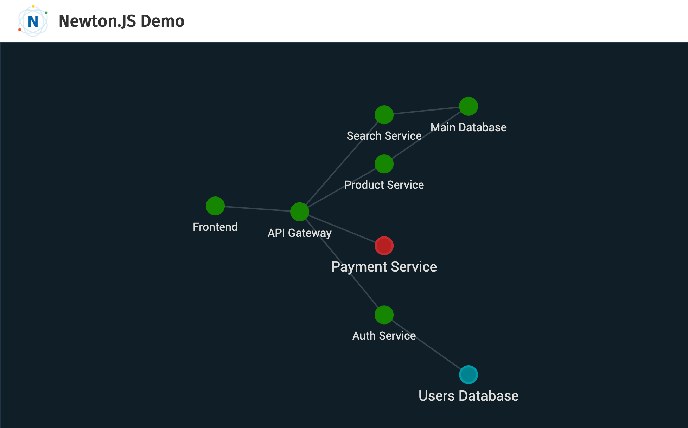

# Newton Graph Prototype 

[](https://travis-ci.org/julie-ng/newtonjs-graph)
[](https://codeclimate.com/github/julie-ng/newtonjs-graph/test_coverage)
[](https://codeclimate.com/github/julie-ng/newtonjs-graph/maintainability)
[](https://snyk.io/test/github/julie-ng/newtonjs-graph?targetFile=package.json)
[](https://dev.azure.com/julie-ng/newton/_build/latest?definitionId=1&branchName=master)

This repository contains learning and prototype code for a high-level dashboard for architects and stakeholders. The goal is to illustrate *product and service dependencies* in a software architecture.

[View API Documentation &rarr;](https://julie-ng.github.io/newtonjs-graph/)



The goal is to visualize architectures in large organizations as organisms that live and breath with deployments, problems, etc. These type of visualization could instead, over time:

- reveal insights about how [Conway's Law](https://en.wikipedia.org/wiki/Conway%27s_law) applies to the organization.
- visual _domain_ (as opposed to technical) dependencies across teams.

## Network - Data Wrapper

A `Network` is essentially a data wrapper. Its biggest advantage is that it dynamically calculating links between nodes, based on a unique identifier `uid`, instead of array indexes.

The basic data format is as so:

```javascript
const nodes = [
	{
		id: "1",
		status: "up",
		label: "Frontend"
	},
	{
		id: "2",
		status: "up",
		label: "API Gateway"
	}
]

const linksMap = [
	{ 
		source: 1, 
		target: 2 
	}
]

const network = new Network(nodes, linksMap)
```

## Graph - Visualization

While `Network` handles the data, `Graph` handles the visualizations, including layout, animations, etc.


```javascript
const graph = new Graph({
	width: window.innerWidth,
	height: window.innerHeight - 60,
	flow: 'horizontal',
	draggable: true
})
const network = new Network(data.nodes, data.linksMap, { uid: 'id' })

graph.init().bind(network)
```

### Event Driven

Note that `Graph` is **event-driven** means that it listens for events, e.g. `update` and updates the visualization automatically depending on the bound network data. 

Example

```javascript
network.on('update', (data) => {
	this.nodes.render(data)
	this.labels.render(data)
	this.links.render(data)
	this.emit('update', data)
})
```

## Development

### Install dependencies

First install the dependencies required:

```
npm install
```

### Preview

To view the prototype in the browser, run

```
npm run dev:demo
```

which starts the webpack dev server and automatically opens [http://localhost:9000](http://localhost:9000) in a browser window.