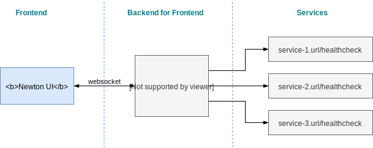

# Newton Graph Library 

[](https://travis-ci.org/julie-ng/newtonjs-graph)
[](https://codeclimate.com/github/julie-ng/newtonjs-graph/test_coverage)
[](https://codeclimate.com/github/julie-ng/newtonjs-graph/maintainability)
[](https://snyk.io/test/github/julie-ng/newtonjs-graph?targetFile=package.json)
[](https://dev.azure.com/julie-ng/newtonjs/_build/latest?definitionId=2&branchName=master)

This repository contains learning and prototype code for a high-level dashboard for architects and stakeholders. The goal is to visualize architectures in large organizations as organisms that live and breathe with deployments, problems, etc. These real-time visualizations could instead reveal insights about how [Conway's Law](https://en.wikipedia.org/wiki/Conway%27s_law) applies to the organization.

This [`newtonjs-graph`](https://github.com/julie-ng/newtonjs-graph) library is **just the frontend**. For details, see the [explanation](#architecture---where-is-the-backend) at the bottom.

#### Readme Contents

- [Live Demo &rarr;](https://newton-demo.azurewebsites.net/?data-server=https://newton-demo-data-editor.azurewebsites.net/)  	
	- [Graph Frontend &rarr;](https://newton-demo.azurewebsites.net/?data-server=https://newton-demo-data-editor.azurewebsites.net/)  	
	- [Data Editor (interactive BFF mock) &rarr;](https://newton-demo-data-editor.azurewebsites.net/)
- [Install](#install)
	- [For Browsers](#for-browsers)
	- [For Webpack](#for-webpack)
- [API Documentation &rarr;](https://julie-ng.github.io/newtonjs-graph/)
	- [Network](#network---data-wrapper)
	- [Graph](#graph---visualization)
	- [Customize Styles](#customize-styles)
- [Architecture - where is the backend?](#architecture---where-is-the-backend) 

### Example Graphs

The following show two different renders from the same demo data set:

| D3.js Engine | Webcola Engine |
|:--|:--|
|  |  | 
| [d3-force](https://github.com/d3/d3-force) creates a "harmonious" distribution of nodes | [cola.js](https://ialab.it.monash.edu/webcola/) can create directional graphs |

### Highlight Relationships with Colors

In both examples above, the "Documents Service" is the **_highlighted node_**. The colors indicate a relationship to this node:

| Color | Relationship | Description |
|:--|:--|:--|
| Green | | In this example, the node had a status of `up`, so it is still green. |
| Red | `is-source` | These nodes directly depend on "Documents Service". |
| Orange | `is-deep-source` | These nodes do not _directly_ require "Documents Service", but may still be impacted. |
| Yellow | `is-target` | These nodes do not require "Documents Service", but may still be effected, e.g. decrease in incoming traffic. |
| Faded Out | `has-no-relationship` | No releationship to highlighted node. |

For more information **[view API Documentation &rarr;](https://julie-ng.github.io/newtonjs-graph/)**

## Install

### For Browsers

Grab the [`newton.bundle.min.js`](./dist/newton.bundle.min.js) and [`newton.css`](./dist/newton.css) files from the [`dist/`](./dist) folder. Then include them in your HTML file.

```html
<!-- import library as `Newton` global -->
<script src="./newton.bundle.min.js" type="text/javascript"></script>
<script type="text/javascript">
	const network = new Newton.Network(…)
	const graph = new Newton.Graph(…)
</script>
```

Note: the documentation refers to module syntax. If you are using the pre-built distribution, you will need to remember to use the `Newton.Graph` instead of `Graph`, etc.

Then continue directions below to define your [`Network`](#network---data-wrapper) and [`Graph`](#graph---visualization).

### For Webpack

First, install the library

```
npm install --save @newtonjs/graph
```

Then in your javascript, include them as you would any other library:

```javascript
const Graph = require('@newtonjs/graph').Graph
const Network = require('@newtonjs/graph').Network
```

And for CSS, you can include the pre-built styles in an SCSS file like so:

```scss
@import "~@newtonjs/graph/dist/newton.css";
```

## Network - Data Wrapper

A `Network` is essentially a data wrapper. Its biggest advantage is that it dynamically calculating links between nodes, based on a unique identifier `uid`, instead of array indexes.

Here is an example data set from the [demo](./demo/data/3a.data.js):

```javascript
const data = {
	nodes: [
		{ id: 'w', label: 'Web Frontend' },
		{ id: 'm', label: 'Mobile Device' },
		{ id: 'b', label: 'Monolith Backend' },
		{ id: 'd', label: 'Database' },
	],
	links: [
		{ source: 'w', target: 'b' },
		{ source: 'm', target: 'b' },
		{ source: 'b', target: 'd' }
	]
}
```

## Graph - Visualization

While `Network` handles the data, `Graph` handles the visualizations, including layout, animations, etc.


```javascript
const network = new Network(data.nodes, data.links)
const graph = new Graph({
	width: window.innerWidth,
	height: window.innerHeight,
	flow: 'horizontal',	
	draggable: true,
	network: network // required
})

graph.init()
graph.on('node:click', (n) => {
	graph.highlightDependencies(n, { arrows: true })
})
```

## Customize Styles

Starting in version 0.2.0, you can use CSS variables to customize your graph. You should not need to edit the pre-built `newton.css` file.

For example, in your CSS, you can just include the following variables and change them as needed:

```css
:root {
	--graph-bg-color: --var(--navy-darker);
	--label-font-family: 'Roboto', sans-serif;
	--label-font-size: 14px;
	--label-text-shadow: 1px 1px 5px rgba(0,0,0,0.2);
	--link-stroke-width: 1px;
	--node-stroke-width: 3px;
}
```

For a list of all available variables, please see [`newton/graph/css/variables.scss`](./newton/graph/css/variables.scss)

## Development

### Clone this repository

```
git clone https://github.com/julie-ng/newtonjs-graph
```

### Install dependencies

First install the dependencies required:

```bash
npm install
```

### Preview

To view the prototype in the browser, run

```bash
npm run demo:dev
```

which starts the webpack dev server and automatically opens [http://localhost:9000](http://localhost:9000) in a browser window.

## Architecture - where is the backend?

So how will this work? This project is very much a work in progress, but the current concept is illustrated below. This repository `newton-graph` is "Newton UI" in the diagram.



| Component | Part of Newton? | Description |
|:--|:--|:--|
| **Frontend** | Yes | This is this component [`newtonjs-graph`](https://github.com/julie-ng/newtonjs-graph), which can be a simple single page application frontend. It expects JSON data with `nodes` and `links` so it knows what to draw.  |
| **BFF** | Maybe? | This component feeds the data to the frontend. Theoretically you can use another service or software for this, as long as you provide data in the JSON format [`newtonjs-graph`](https://github.com/julie-ng/newtonjs-graph) needs to draw the visualization. |
| **Services** | No | These are services _you_ consider to be part of your architecture. They must expose endpoints that can be polled. |
